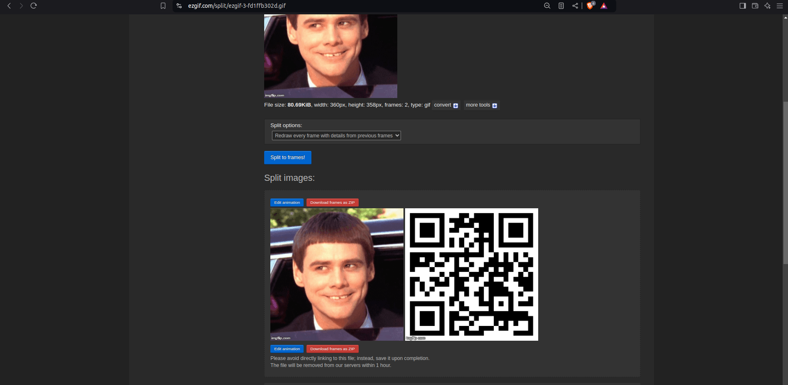
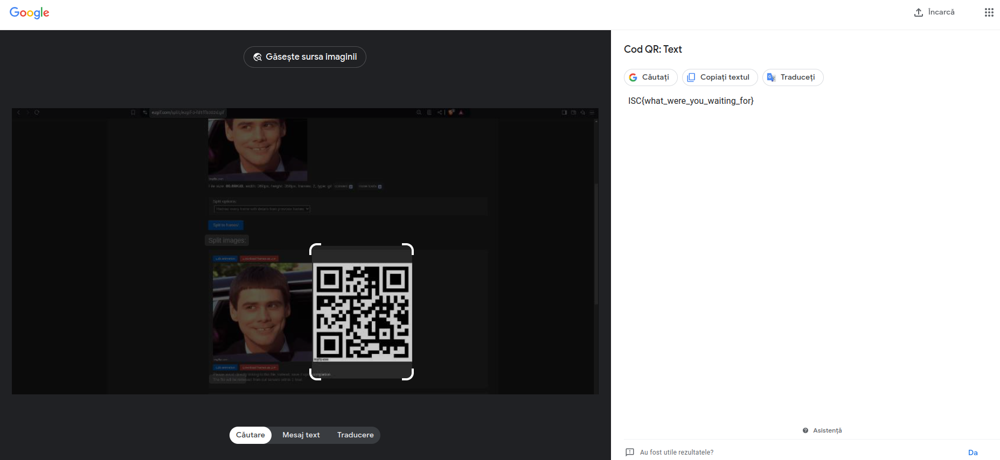

# Lab 01 - Introduction

*Cuprins*:
- [Lab 01 - Introduction](#lab-01---introduction)
  - [Task 01 | Decode 'til You Drop](#task-01--decode-til-you-drop)
  - [Task 02 | Zip it good](#task-02--zip-it-good)
  - [Task 03 | Find the impostor](#task-03--find-the-impostor)
  - [Task 04 | Unknown File Type](#task-04--unknown-file-type)
  - [Task 05 | Corrupted File](#task-05--corrupted-file)
  - [Task 06 | Hidden File](#task-06--hidden-file)
  - [Task 07 | Waiting for eternity](#task-07--waiting-for-eternity)
  - [Task 08 | The great file squeeze](#task-08--the-great-file-squeeze)

## Task 01 | Decode 'til You Drop


> Flag obtinut: **ISC{44e1da16-40a7-4439-bac0-ceb5b20ae481}**


Am urmatorul string codificat de mai multe ori in **base64**:
```
VmxSR1lWUXhTa2hXYWxwV1ZrVkthRlpyVm1GamJHUlhWV3RhVG1FemFGWldWbWhyVjJ4YVNGUnFRbFZoTVVwVFdsZHpOVlpGTVZoaVJuQlhUVVJGZWxaRldtdFVNa3BIWWtoR1YySlhlRTlaVjNSTFlqRmtjMVZzU2s5U1ZFWmFWRlZSZDFCUlBUMD0=
```


Cel mai usor am aflat flag-ul decodand iterativ intr-un pipeline din **shell**:


```sh
$ echo <string> | base64 -d | base64 -d | base64 -d | base64 -d | base64 -d
```


Sau... metoda muncitoreasca:

```py
#!/usr/bin/env python3

import base64

encoded_text = b'....'

# Solution:
flag = base64.b64decode(encoded_text).decode("utf-8")
flag = base64.b64decode(flag).decode("utf-8")
flag = base64.b64decode(flag).decode("utf-8")
flag = base64.b64decode(flag).decode("utf-8")
flag = base64.b64decode(flag).decode("utf-8")


print("Final decoded text:", flag)
```


## Task 02 | Zip it good

> Flag obtinut: **ISC{991e7f7d-ac8e-4570-a012-8fb9314b4380}**

Fisierul **passwords.txt** contine o lista cu posibile parole cu care arhiva a fost critata.


Varianta in **bash**


```sh
# Sintaxa sh dezarhivare cu parola
$ unzip -P 'parola' archive.zip
```


```sh
#!/usr/bin/env bash

for passwd in $(cat passwords.txt) ; do
    unzip -P "$passwd" crack_me.zip
    exit_code=$?
    if [[ $exit_code == 0 ]] ; then
        echo "Yuppi! Password found: $passwd"
        exit 0
    fi
done
```


Varianta in **python**:

```py

def crack_zip(zip_file, passwords_file):
    with zipfile.ZipFile(zip_file) as zf:
        with open(passwords_file, 'r') as pf:
            for line in pf:
                password = line.strip()
                try:
                    zf.extractall(pwd=bytes(password, 'utf-8'))
                    print(f"Yuppi! Password found: {password}")
                    return 0
                except:
                    continue
            print("[ERROR] The 'passwords.txt' does NOT contain a valid password!", file=sys.stderr)
            return 1 
    return None


if __name__ == '__main__':
    crack_zip('crack_me.zip', 'passwords.txt')
```


> Parola este **sunshine**.


## Task 03 | Find the impostor

> Flag obtinut: **ISC{manual-pages-are-your-friends}**


```sh
$ find inhere/ -type f -readable -size 987c ! -executable

$ cat $(find inhere/ -type f -readable -size 987c ! -executable)
```


## Task 04 | Unknown File Type

> Flag: **ISC{file_is_our_friend}**.


```sh
# file - determine file type
$ file 04-File
# 04-File: gzip compressed data, was "01-File", last modified: Sun May 14 01:10:24 2017, from Unix, original size modulo 2^32 25

# extracting the archive 04-File
$ gunzip -c 04-File > resulted-file

$ cat resulted-file
# ISC{file_is_our_friend}
```


## Task 05 | Corrupted File


> Flag-ul obtinut: **ISC{no_more_ideas_for_flags}**.


Am folosit un editor online de `hexedit`
si am inlocuit header-ul fisierului din arhiva
cu header-ul corect pentru o imagine `.jpg`.

Cu https://hexed.it/, a mers sa dau direct drag-and-drop
la fisier din folder in web-site, iar apoi, in comparatia cu tool-ul CLI,
am editat omeneste octetii.


Header-ul pt `.jpg`:


```
FF D8 FF E0 00 10 4A 46 49 46 00 01 01 01 00 60
00 60 00 00 FF FE 00 13 43 72 65 61 74 65 64 20
```


Pasi pt https://hexed.it/:
- Copy paste la octetii de mai sus
- Am pus frumos cursorul pe primul numar 
- **CTRL V**
- Am ales "overwrite the bytes at the cursor position" (actiunea)
- Am ales "Hexadecimal Values" (formatul datelor)


Imaginea corectata contine si flag-ul :)


## Task 06 | Hidden File

> Flag-ul obtinut: **ISC{fileception_is_real}**.


Aici s-a citit un manual :)

`binwalk` - tool for searching binary images for embedded files and executable code


```sh
# Scan for embedded files and extract them
$ binwalk -e 06-Idea.jpg
```
```

DECIMAL       HEXADECIMAL     DESCRIPTION
--------------------------------------------------------------------------------
0             0x0             JPEG image data, JFIF standard 1.01
33519         0x82EF          7-zip archive data, version 0.4
```


```sh
$ binwalk -D='.*' 06-Idea.jpg
```

`-D='.*'` is a parameter that specifies a regular expression
(`.*` matches any sequence of characters).


```sh
# Aici chiar nu stiu ce se intampla, a explicat laborantul :)
cd _06-Idea.jpg.extracted/
7z x 82EF
```


## Task 07 | Waiting for eternity


Pune [07-Dumb.gif](./ex7/07-Dumb.gif) la https://ezgif.com/.

Vei obtine:

<br>

<br>


Vezi ca contine un **QR**.

Da un **Google Lens** pe **QR**.

<br>

<br>


> Flag-ul obtinut: **ISC{what_were_you_waiting_for}**.


## Task 08 | The great file squeeze

