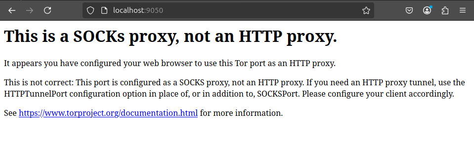
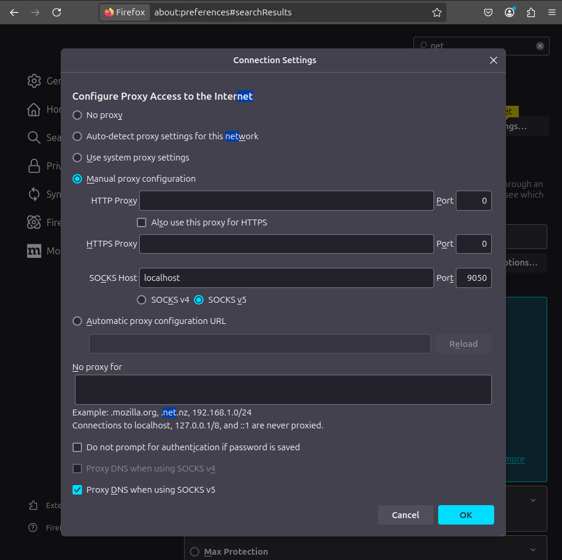
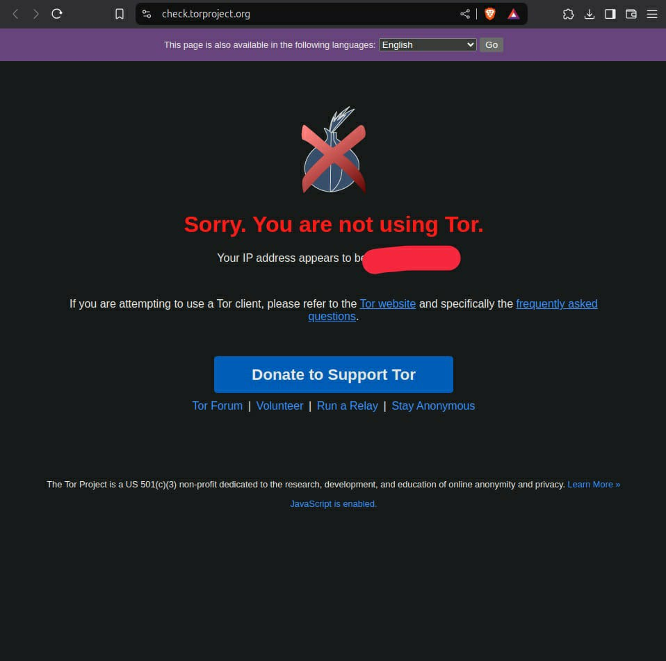
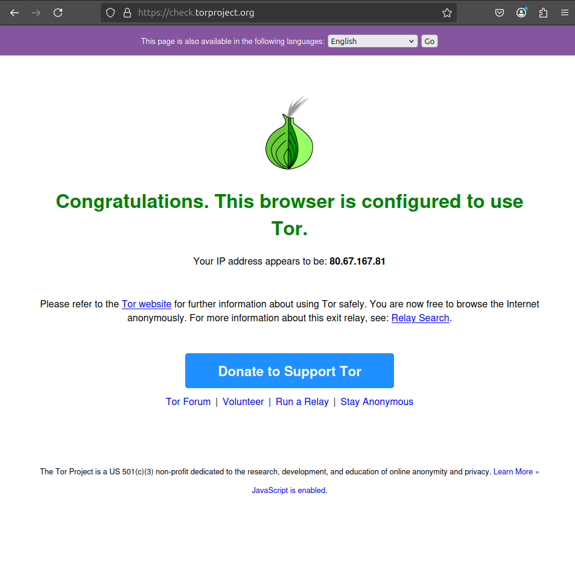

# Lab 11 - Privacy Technologies


*Cuprins*:
- [Lab 11 - Privacy Technologies](#lab-11---privacy-technologies)
  - [Tor](#tor)
    - [Configurare Tor](#configurare-tor)
    - [DNS peste TCP (nu cred ca merge :()](#dns-peste-tcp-nu-cred-ca-merge-)
    - [Verificare adresa IP publica](#verificare-adresa-ip-publica)
    - [SSH (Local) Port Forwarding](#ssh-local-port-forwarding)
    - [Configurare Socks5 Proxy in Firefox](#configurare-socks5-proxy-in-firefox)

## Tor


### Configurare Tor

```sh
sudo apt update && sudo apt install -y tor
```


Am cautat (`-i` **case insensitive**) textul "SOCKSPort 9050" in fisierul de configuratie TOR `/etc/tor/torrc`
si l-am deschis la linia unde se afla acest text pentru a o decomenta:


```sh
$ grep -i -n 'SOCKSPort 9050' /etc/tor/torrc
18:#SocksPort 9050 # Default: Bind to localhost:9050 for local connections.
```
```sh
sudo nano -l +18 /etc/tor/torrc
```


### DNS peste TCP (nu cred ca merge :()

Pentru a impune ca query-urile de DNS sa se faca peste TCP,
Chat GPT mi-a recomandat sa configurez **unbound** (nu stiu cat de bn este tho).


```sh
sudo apt install unbound -y
```

```sh
sudo nano /etc/unbound/unbound.conf.d/custom.conf
```
```
server:
    do-udp: no
    do-tcp: yes
```

```sh
sudo systemctl restart unbound
```

Comanda de verificare:

```sh
sudo systemctl status unbound
```

### Verificare adresa IP publica


```sh
sudo systemctl restart tor
```

```sh
sudo systemctl status tor
```

Pentru a afla adresa mea reala:
```sh
➜ curl ifconfig.me
141.85.150.35
```
Sau:
```sh
student in ~ at isc-vm …
➜ dig TXT +tcp +short o-o.myaddr.l.google.com @ns1.google.com | awk -F'"' '{ print $2 }'

141.85.150.35

```


Pentru a deschide un shell in **torsocks**:

```sh
torsocks bash
```


```sh
student in ~ at isc-vm …
➜ torsocks bash

student@isc-vm:~$ dig TXT +tcp +short o-o.myaddr.l.google.com @ns1.google.com | awk -F'"' '{ print $2}'
80.67.167.81

student@isc-vm:~$ curl https://check.torproject.org/api/ip
{"IsTor":true,"IP":"80.67.167.81"}
```


### SSH (Local) Port Forwarding


Pe calculatorul meu:


```sh
ssh -J <moodle-username>@fep.grid.pub.ro -L 9050:localhost:9050 -N -T student@<IP-VM>
```


| Optiune SSH | Descriere |
| :--- | :--- |
| `-L` | Creeaza un tunel **local** de **port forwarding** |
| `-N -T` | Impiedica SSH sa deschida un **shell** pe remote |


### Configurare Socks5 Proxy in Firefox

Daca scriu urmatorul URL in browser, <http://localhost:9050>,
o sa imi apara urmatorul text de eroare:



Pentru a folosi Tor Proxy,
1. Am deschis browser-ul local Firefox
2. Click pe meniul din coltul dreapta-sus
3. Select **Setting**
4. La search bar-ul unde scrie *Find in settings* am cautat **network**
5. La optiunea **Network Settings** -> click pe butonul **Settings**
6. Paste urmatoarea configuratie




Acum Tor functioneaza in browser-ul de Firefox.


Before and After:



